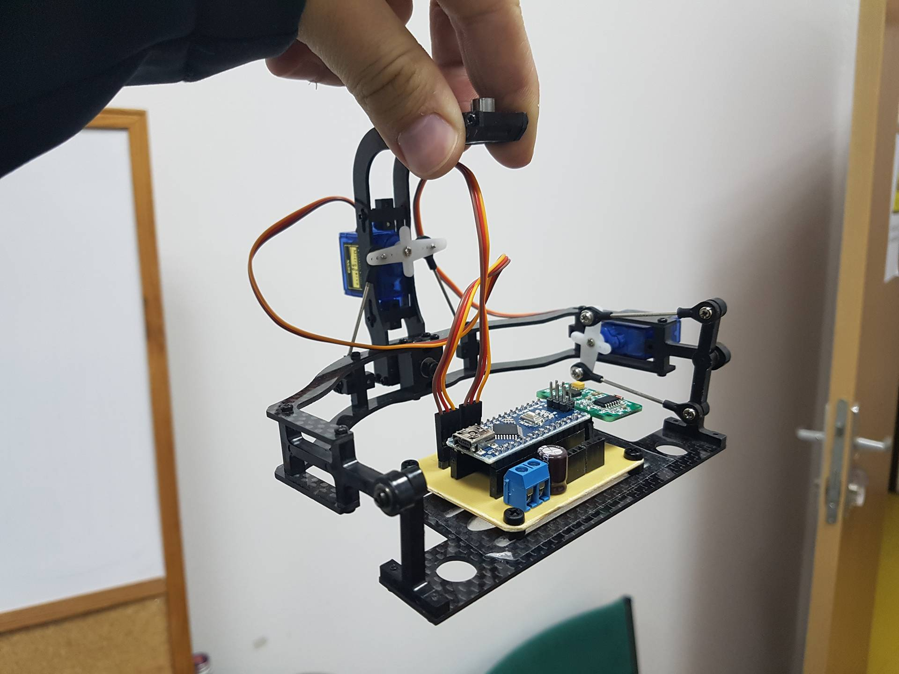
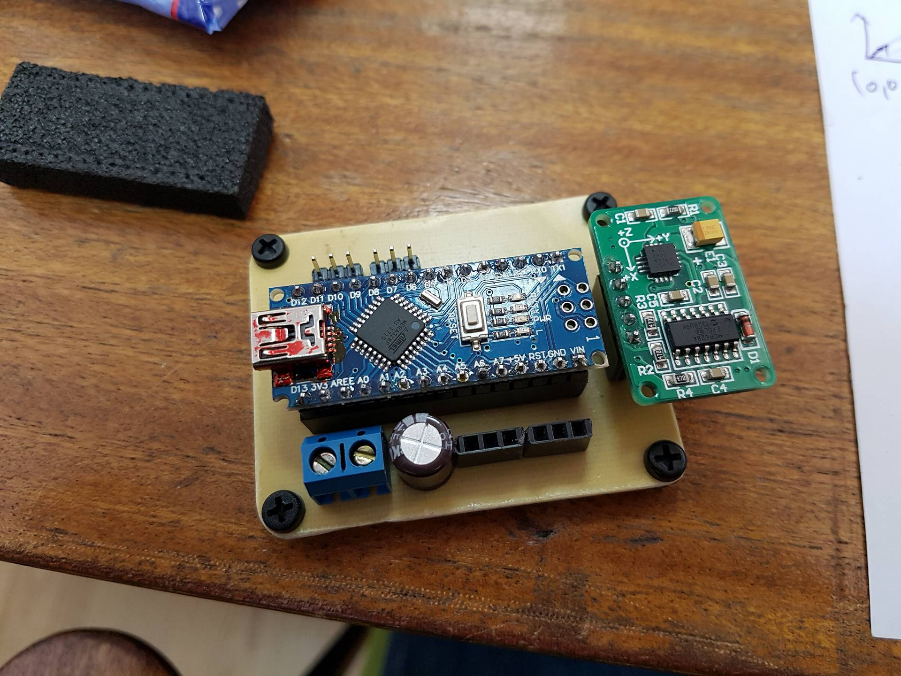

# The Camera De-Jiggler

From February until mid-May of this year, I completed an internship at [Vision Dynamix](http://www.visiondynamix.com), a software start up founded in 2016 which develops mapping software for unmanned aerial vehicles based on SLAM systems for 3D reconstruction.

I worked on a handful of small tasks here and there, but in general the internship was based around creating a camera stabiliser. Now, when starting this project, my mentor and I discussed the benefits and drawbacks of various designs. As most engineering situations go, the largest drawback to any particular solution was the price tag, whereas the main benefit was that it actually fulfilled the base requirements. A full brushless DC motor system with a custom low-speed ESC using 3-per-chip H-bridges and PWM to simulate low frequency sine waves was our favourite solution. We already had some larger BLDCs (which would have to be replaced with smaller ones later), and we had enough MCUs to shake a stick at.

We ordered the H-bridges online, but saw that their shipping time would be anywhere from 18-40 days. In the meantime, we decided that I should design a general prototype/PoC on the other end of the budget spectrum: using plastic geared 9g servos and an Arduino Nano.

**Spoiler alert:** The bridges arrived after my internship ended.

The servos behaved better than expected, but they had 3 flaws:
* They're *just* fast enough to trick you into thinking they might be usable.
* After just a few minutes of use they were too hot to touch.
* Their electronics had a terrible habit of frying whenever I connected the power backwards. This is completely my fault but I just wanted to mention that I don't get along with servos.  

The system consisted of:
* A prebuilt mechanical framework
* A 3-axis linear accelerometer from Mikroelektronika
* An Arduino Nano
* 2x9g Servo Motors doomed to an early grave

Using some math, I was able to convert the linear readings into rotational readings based on the sensor's interaction with gravity. The calculations included floating point operations and the usage of ***<math.h>***'s functions, so it suffices to say that these probably slowed the process down and are partially to blame for its lack of responsiveness.

However, through the magic that is PD control, I managed to code up something that responded about as quickly as the servos and my knowledge would allow me to. The error signal from the sensor is fed into the PD controller before adding or subtracting the amplified value to the width of the PWM signal (in microseconds).

The picture at the top of the blog is the "final" product, whereas below you can see the handmade PCB:

