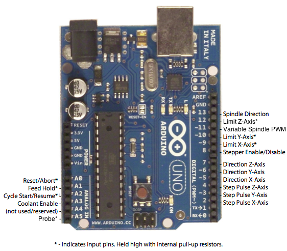
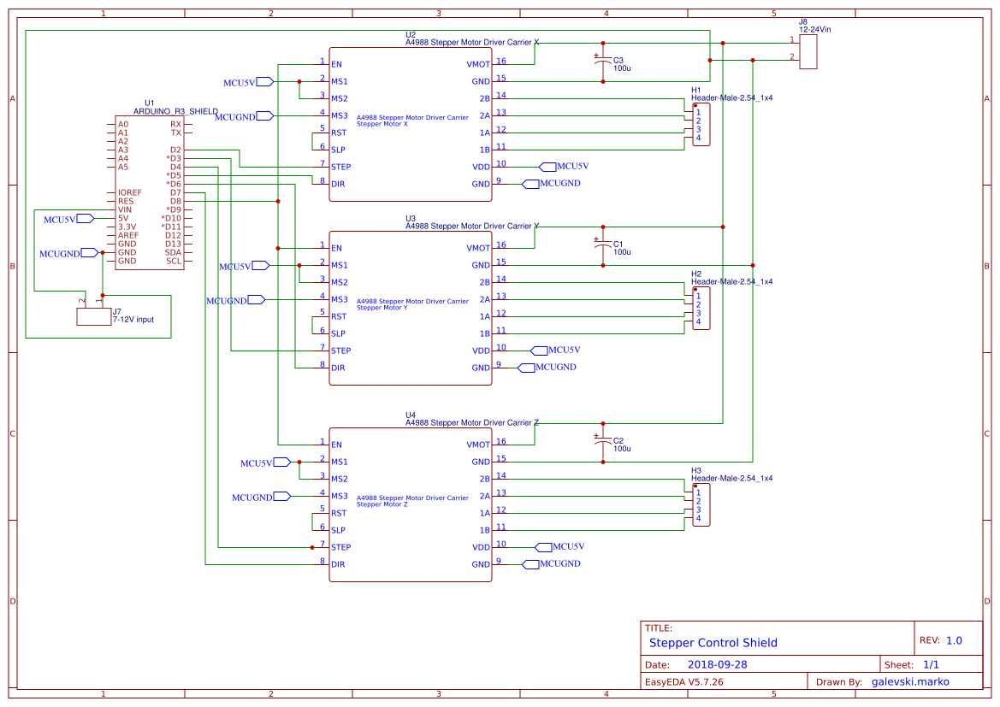
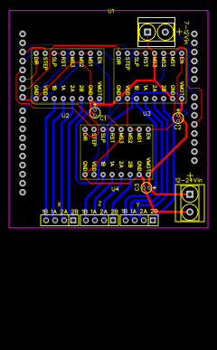

# Marko performs a Brain Transplant - Part 1
### [<<HOME](index.md)

For at least the last 10 years, my dad has had this 3-axis CNC router lying around. It was bought in an assemble-it-yourself flatpack, and after assembling it he found that the software that came with it was far too clunky, unstable, and poorly documented to actually use. It has ever since lain around, gathering dust. And of course we lost the dongle for the original software, how couldn't we?

So, the task became clear - get it alive and kicking again.

After doing a bit of research, I ordered a 3D printer Arduino MEGA + RAMPS 1.4 combo. When it arrived, my biggest problem was finding the pin mapping and interface for the included GLCD screen, but I also struggled with figuring out a (less time consuming way) to adapt preexisting open source 3D printer software like [Marlin](http://github.com/MarlinFirmware/Marlin) to the stepper controls.

However, I then stumbled upon [grbl](http://github.com/gnea/grbl) (and it's [MEGA port](http://github.com/gnea/grbl-mega)), which promised to push the Arduino's MCU to its limit. However, it had strict pin mappings I was too afraid to touch because I know just how finicky microntrollers can be with their pins. I abandoned the RAMPS board and decided I'd run grbl on my Arduino Uno and use this as an opportunity to improve my hardware and PCB design skills by designing my own motor control shield.

I hopped on EasyEDA and sketched up what I think will be a perfectly fine and simple solution, given that I have A4988 carrier boards with all the requisite capacitors, resistors, and trim pots taken care of.

The Arduino Uno grbl pinout is shown below:

The schematic follows the instructions outlined in the grbl wiki and the A4988 datasheet, and is fairly self evident. The enable pins are controlled unanimously by the enable pin on grbl, and each stepper has its own pulse and direction control. I hardwired the microstepping inputs (MS1-3) on all three controllers to a High-High-Low configuration, enabling 1/8th microstepping, and I plan to power the steppers on a 20-24V power supply. I'm unsure if it's better to place three 100uF capacitors right over the power input to the three individual chips or if I should just place the parallel equivalent 300uF capacitor right over the power supply. I'll need to look into that.

The schematic for the shield is below:

And, in my first ever serious non-Fritzing PCB layout, I present to you my first three-axis stepper motor control shield draft (of probably many):

I've probably horrendously overdesigned the width of the 24V line traces, and anything even remotely related to them. But you know what they say: "Copper's free!"

I really should do some actual math though.

That's all for now, tune in next time to see a smouldering wreck of a CNC machine!

P.S. You can follow my progress (and find the schematics/pcb layouts) on my EasyEDA profile https://easyeda.com/galevski.marko/motor-control-shield
